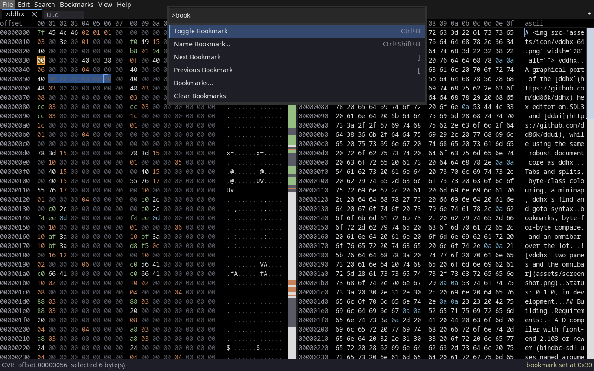

#  vddhx

A graphical port of the [ddhx](https://github.com/dd86k/ddhx) hex editor on
SDL3 and [ddui](https://github.com/dd86k/ddui), while using the same robust document core as ddhx.

Tabs and splits, byte-class colouring, a minimap, ddhx's find and goto syntax,
bookmarks, byte-for-byte compare, and an omnibar over the lot.



Status: 0.1.0, in development.

## Building

Requirements:
- A D compiler with front-end 2.103 or newer (bindbc-sdl uses named arguments)
  - DMD: 2.103 or newer
  - GDC: 14 or newer (13 has the front-end, but its back-end crashes on bindbc-sdl)
  - LDC: 1.33 or newer
- DUB: Available via dlang.org (bundled with dmd) or your distro's package manager

The default configuration opens SDL3 dynamically at startup, so you'll need the
SDL3 and SDL3_ttf shared libraries installed (`libsdl3-0` and `libsdl3-ttf-0` on
Debian/Ubuntu, `SDL3.dll` and `SDL3_ttf.dll` beside the executable on Windows).

```
dub build
```

The `static` configuration links SDL3 in instead, for a binary that runs with
nothing installed, and needs the libraries built first:

```
./build-sdl3-debian.sh      # installs libSDL3.a / libSDL3_ttf.a into ~/.local
dub build -c static
```

Windows uses `build-sdl3.ps1`, which installs into `./install` instead.

## Hacking

`source/README.md` has the module map and the cross-module notes.

## License

MIT, see [LICENSE](LICENSE). Copyright (c) 2026, dd86k <dd@dax.moe>.

Dependencies:
- [ddhx](https://github.com/dd86k/ddhx) (MIT),
- [ddui](https://github.com/dd86k/ddui) (BSD-3-Clause),
- [ddlogger](https://github.com/dd86k/ddlogger) (BSL-1.0),
- [bindbc-sdl](https://github.com/BindBC/bindbc-sdl) (BSL-1.0),
- and [SDL3](https://github.com/libsdl-org/SDL) with SDL3_ttf (zlib).

The `static` configuration also links FreeType and HarfBuzz into the binary:
portions of that build are copyright (c) The FreeType Project
(<https://freetype.org>), all rights reserved.
